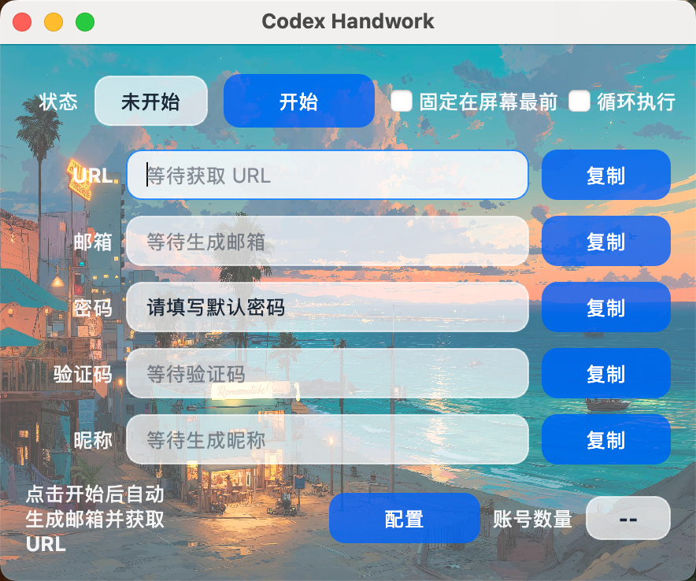
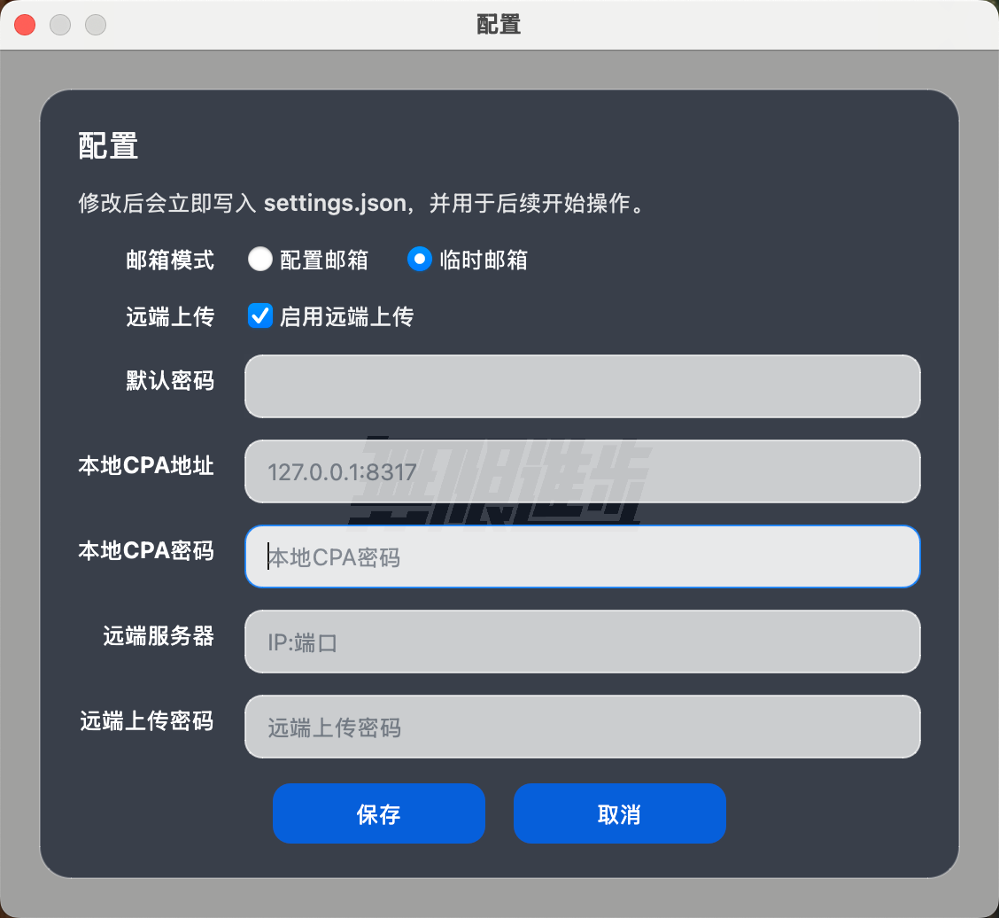

# Codex Handwork
注：目前这个好像仅仅支持mac电脑的google浏览器，切换到win后手动注册也会弹手机验证码。

前言：由于采用自动化或协议来注册codex时，会出现手机验证码，特意开发了一个可以支持屏幕悬停的手动注册工具，目前该工具支持cloudmail自建邮箱和临时邮箱模式。

功能：自动获取 cpa 的 codex-oauth 登录链接，获取后自动复制到剪贴板，生成设定好的邮箱和密码，只需要设置邮箱的域名和前缀（所以给一个值段，如 test，则生成的邮箱为 test00001@cloudmail.com，到 99999），并自动获取验证码进入剪贴板。注册完成后会自动回调到本地 CPA；当前版本的远端上传功能已暂时停用，等待新的上传逻辑接入。

一个基于 PySide6 的桌面工具，用于串联邮箱生成、认证 URL 获取、验证码轮询和认证状态查询流程。

## 项目结构

```text
Codex_Handwork/
├── data/                     # 运行时数据
│   └── email_counter.json
├── gui.py                    # 主启动入口
├── pyproject.toml            # 项目元数据
├── requirements.txt          # 依赖列表
├── settings.json             # 项目配置（包含敏感信息，不应提交）
└── src/
    └── codex_handwork/
        ├── app.py            # 应用启动逻辑
        ├── gui.py            # 主窗口实现
        ├── settings.py       # settings.json 加载逻辑
        ├── assets/           # 静态资源
        └── services/         # 业务模块
```

## 安装依赖

```bash
python3 -m pip install -r requirements.txt
```

## 启动方式

先安装依赖：

```bash
python3 -m pip install -r requirements.txt
```

源码目录下可直接运行根目录启动脚本：

```bash
python3 gui.py
```

也可以用模块方式启动：

```bash
PYTHONPATH=src python3 -m codex_handwork.app
```

安装为包后也可以直接运行：

```bash
codex-handwork
```

## 主要模块

- `src/codex_handwork/gui.py`：主窗口与流程控制
- `src/codex_handwork/services/email_store.py`：邮箱编号持久化
- `src/codex_handwork/services/mail.py`：邮件与验证码查询
- `src/codex_handwork/services/oauth.py`：认证 URL 获取
- `src/codex_handwork/services/status.py`：认证状态查询

## 数据说明

- `data/email_counter.json`：旧版本项目根目录中的邮箱编号文件，现版本会优先使用用户目录中的新位置
- `src/codex_handwork/assets/background.png`：主界面背景图
- `src/codex_handwork/assets/app_icon.png`：程序图标，同时也作为当前配置弹窗背景图
- `settings.json`：统一配置文件，现版本会优先写入用户自己的配置目录

## 页面展示

### 主页



### 配置页



## 配置按钮

主界面底部提供了 `配置` 按钮。

点击后会弹出配置表单，可直接修改以下内容：

- 默认密码
- 邮件列表接口地址
- 邮件接口 `authorization`
- 本地 CPA 地址（只填 `127.0.0.1:8317` 这种 `host:port`）
- 本地 CPA 密码
- 邮箱前缀
- 邮箱域名

保存后会立即写回 `settings.json`，后续再次点击 `开始` 时会直接使用新配置，不需要重启程序。

如果选择“临时邮箱”模式，则不再需要配置邮件接口地址、邮件 `authorization`、邮箱前缀和邮箱域名这些邮箱相关选项。

## 自动复制说明

程序会自动把关键内容写入剪贴板：

- 成功获取认证 URL 后，会自动复制 URL
- 成功监听到当前邮箱的验证码后，会自动复制验证码

这样可以减少手动复制操作。

## settings.json 说明

首次使用时，如果用户目录里还没有 `settings.json`，程序会自动从 `settings_example.json` 初始化一份配置文件。

复制后，把 `settings_example.json` 里标注“需要你自己填写”的内容改成你自己的真实配置即可，或者在 GUI 中配置。

当前版本中：
- `settings.json` 会优先保存在用户自己的配置目录
- `email_counter.json` 会优先保存在用户自己的数据目录
- 旧项目根目录中的配置和计数文件仍会被兼容读取
- 远端上传功能已暂时停用，当前无需配置远端 CPA

`settings.json` 主要分为四组。

示例：

```json
{
  "gui": {
    "window_title": "Codex Handwork",
    "default_password": "qwe123123123",
    "callback_port": 1455,
    "nickname_length": 6,
    "status_message_timeout_ms": 2000,
    "auth_poll_interval_ms": 3000,
    "code_poll_interval_seconds": 7,
    "next_round_delay_ms": 5000
  },
  "mail": {
    "url": "https://example.com/api/allEmail/list",
    "authorization": "eyJ....",
    "request_timeout_seconds": 30,
    "params": {
      "emailId": 0,
      "size": 50,
      "timeSort": 0,
      "type": "receive",
      "searchType": "name"
    },
    "headers": {
      "accept": "application/json, text/plain, */*",
      "referer": "https://example.com/all-mail",
      "user-agent": "Mozilla/5.0"
    }
  },
  "oauth": {
    "base_address": "127.0.0.1:8317",
    "authorization_suffix": "CPA密码",
    "request_timeout_seconds": 30,
    "auth_url_params": {
      "is_webui": "true"
    },
    "headers": {
      "Accept": "application/json, text/plain, */*",
      "User-Agent": "Mozilla/5.0"
    }
  },
  "email": {
    "prefix": "test",
    "domain": "@example.com",
    "min_index": 1,
    "max_index": 99999
  }
}
```

实际项目中的 `settings.json` 还包含若干 `*_comment` 字段，用来说明每个配置项的作用；上面的示例只保留核心字段，便于快速理解结构。

### 1. `gui`

界面行为相关配置：

- `window_title`：主窗口标题
- `default_password`：主界面默认填入的密码
- `callback_port`：开始流程前会尝试释放的本地端口
- `nickname_length`：自动生成昵称的长度
- `status_message_timeout_ms`：短提示显示时长
- `auth_poll_interval_ms`：认证状态轮询间隔
- `code_poll_interval_seconds`：验证码轮询间隔
- `next_round_delay_ms`：循环执行模式下下一轮开始前的等待时间

### 2. `mail`

邮件接口相关配置：

- `url`：邮件列表接口地址
- `authorization`：邮件接口请求头中的 `authorization` 值
- `request_timeout_seconds`：请求超时秒数
- `params`：请求邮件列表时附带的查询参数
- `headers`：除 `authorization` 外的静态请求头

说明：程序运行时会把 `mail.authorization` 动态写入请求头，不需要手动再去 `headers` 里改。

### 3. `oauth`

本地 CPA 管理接口相关配置：

- `base_address`：本地接口基础地址，只填写 `host:port`
- `authorization_suffix`：本地 `Authorization: Bearer xxx` 中 `xxx` 的部分
- `request_timeout_seconds`：请求超时秒数
- `auth_url_params`：获取认证 URL 时附带的查询参数
- `headers`：通用静态请求头

说明：程序运行时会根据 `base_address` 自动拼出以下本地接口地址：

- `http://{base_address}/v0/management/codex-auth-url`
- `http://{base_address}/v0/management/get-auth-status`

同时会自动生成：

- `Authorization: Bearer {authorization_suffix}`
- `Referer: http://{base_address}/management.html`

### 4. `email`

邮箱生成规则：

- `prefix`：邮箱前缀
- `domain`：邮箱域名
- `min_index`：最小编号
- `max_index`：最大编号

生成邮箱时格式为：`{prefix}{5位编号}{domain}`。

## 注意

- `settings.json` 包含敏感信息，不要提交到仓库
- 当前程序会直接读取这个文件，缺少关键字段会导致启动失败
- GUI 配置表单只暴露常用字段，其他高级字段仍可直接手动编辑 `settings.json`
